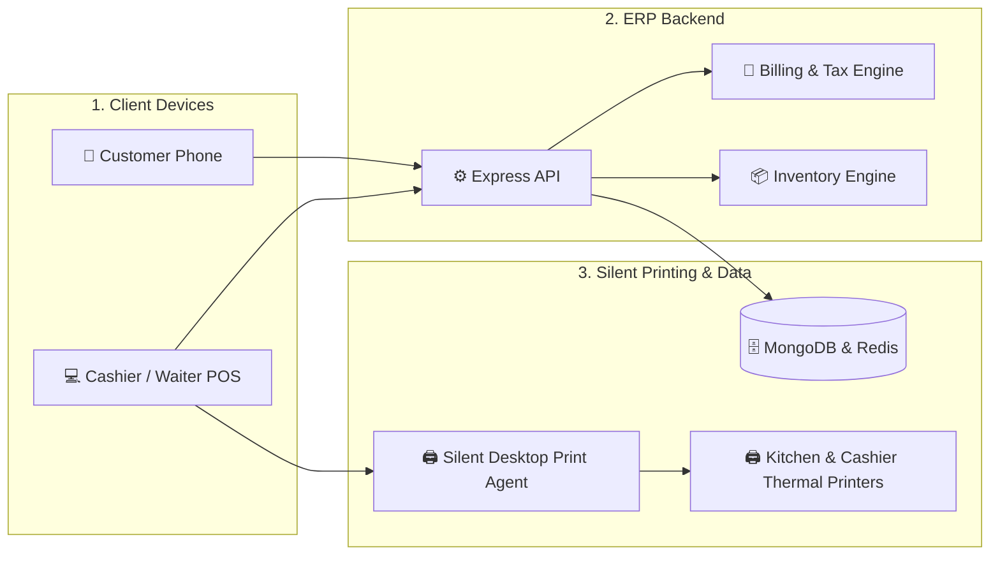
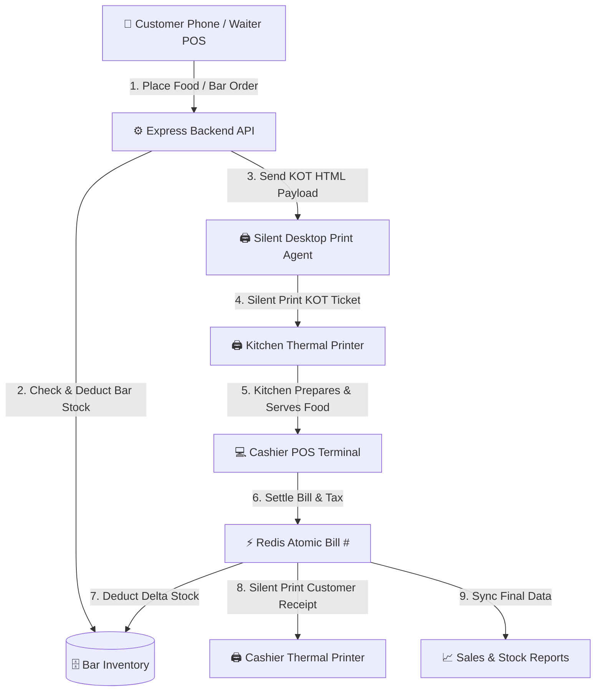
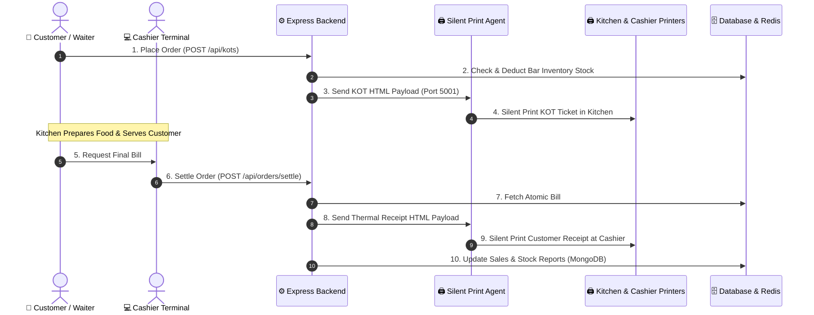
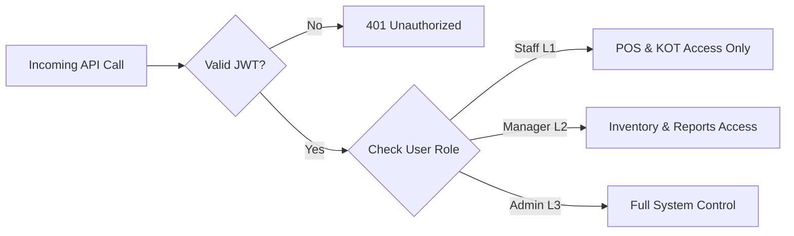

# Bar POS System (V2.0 — Production ERP)

A **premium, enterprise POS & Inventory System** engineered specifically for **Bar & Restaurant POS Operations**.  
Features **atomic bill numbering, real-time stock deduction, silent thermal desktop printing**, and **role-secured API protection**.

---

<p align="center">
  
  
  
  
</p>

---

## ⚡ Quick Demo & Credentials

### 1. Local One-Command Startup
```bash
npm install
cd frontend && npm install && cd ..
npm run dev
```

### 2. Demo User Accounts
| Role | Username | Password | Permissions & Access Level |
| :--- | :--- | :--- | :--- |
| **Admin** | `admin` | `admin123` | Full Access: Settings, User Management, Cache Clear |
| **Manager** | `manager` | `manager123` | Operational Access: Inventory, Workers, Sales Reports |
| **Staff** | `staff` | `staff123` | POS Operations: Billing & KOT Creation |

### 3. Zero-Setup Automated Audit (`npm test`)
```bash
npm test  # Executes all 56 automated test cases in ~6 seconds
```

---

## 🏗️ System Architecture



---

## 🔄 End-to-End Workflow & Dataflow

### 1. Customer-to-Cashier Process Flow



---

### 2. Order Settlement Sequence Dataflow



---

## 🚀 Key Features

1. **Decoupled Menu & Inventory:** Kitchen items bypass stock tracking for zero billing latency; Bar items track exact bottle-to-peg inventory in real time.
2. **Delta Stock Protection:** Deducts inventory during KOT creation and only deducts newly added items upon final bill printing to prevent double-deduction.
3. **Atomic Bill Numbering:** Resilient daily sequential bill counter powered by Redis `INCR`.
4. **Direct Kitchen Silent Printing:** Local agent running on port `5001` that spools PDFs silently to Kitchen & Cashier ESC/POS thermal printers.

---

## 🔒 Security & Role-Based Access Control (RBAC)



---

## 🧪 Automated Testing (`56/56 Passed`)

```
PASS  src/test/rigorous_pos_audit.test.js (24 tests)
PASS  src/test/orders.test.js              (6 tests)
PASS  src/test/tough_audit.test.js         (5 tests)
PASS  src/test/kots_management.test.js      (4 tests)
PASS  src/test/inventoryReport.test.js     (4 tests)
PASS  src/test/cors.test.js                (4 tests)
PASS  src/test/settings.test.js            (2 tests)
PASS  src/test/menu.test.js                (2 tests)
PASS  src/test/auth.test.js                (2 tests)
PASS  src/test/health.test.js              (1 test)
```

---

## 🛠️ Tech Stack & Installation

- **Frontend:** React 18, Vite, Tailwind CSS, Socket.IO Client
- **Backend:** Node.js, Express 4, Socket.IO, Mongoose
- **Database & Cache:** MongoDB Atlas, Upstash Redis
- **Silent Printing:** Silent Desktop Print Agent (Port 5001 + SumatraPDF)

```bash
# Backend Server Setup
npm install && npm run dev

# Frontend App Setup
cd frontend && npm install && npm run dev

# Silent Print Agent Setup (Client PC)
cd print-agent && npm install && npm start
```

---

## License

Built for **Bar & Restaurant POS ERP**. All rights reserved.
