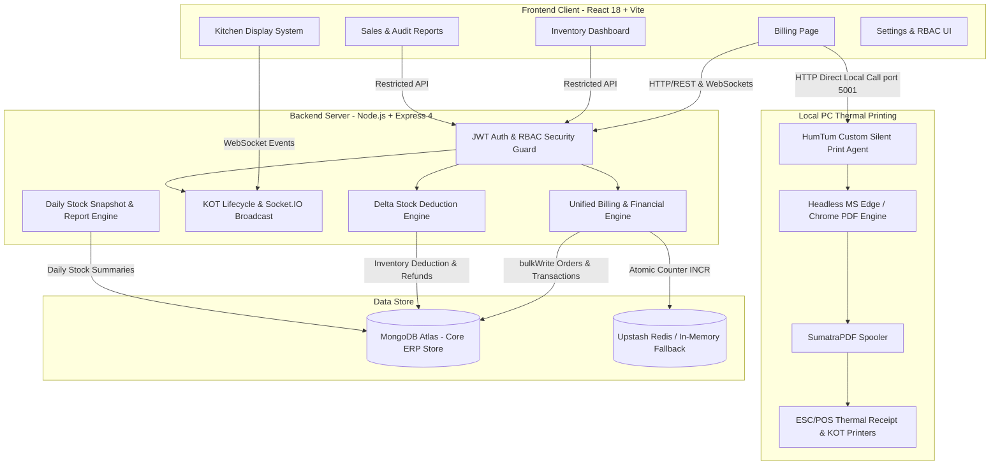
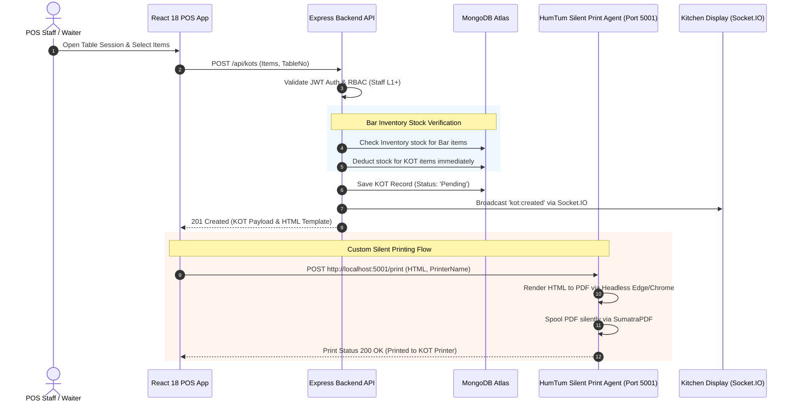
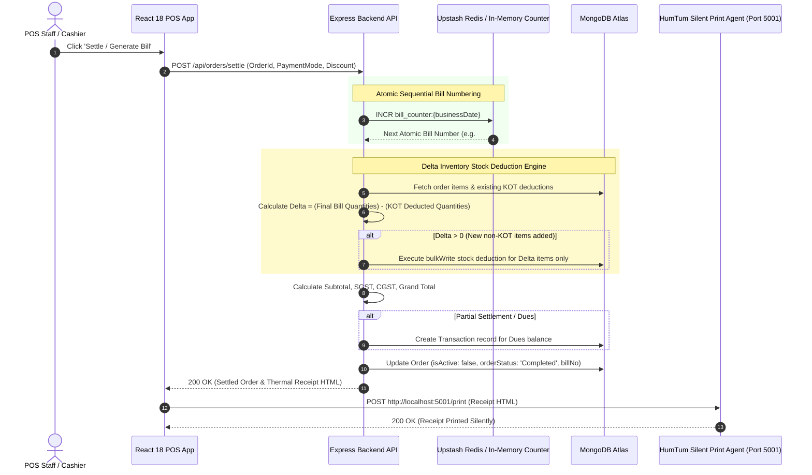
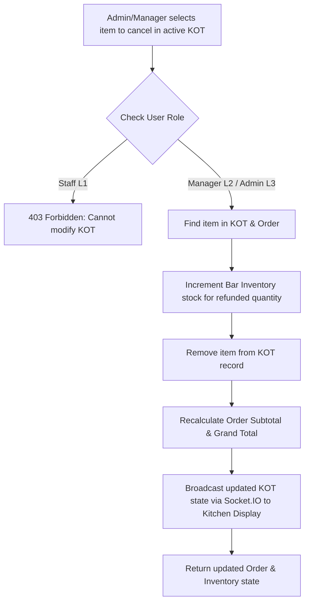
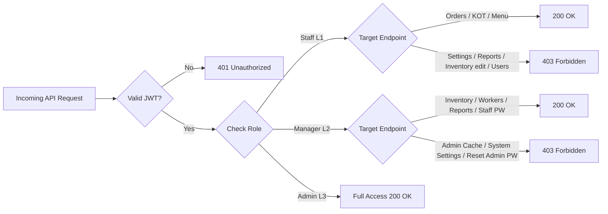

# BAR & Restaurant POS System (V2.0 — Enterprise-Grade Hospitality ERP)

A **premium, production-ready Restaurant & Bar POS ERP System** engineered specifically for **HumTum Bar & Restaurant**. 
Built with **enterprise-level architecture, atomic data integrity, role-secured API security, custom silent desktop printing, and an automated stock & financial engine**, this platform delivers high concurrency safety and real-time operational control.

---

<p align="center">
  
  
</p>

<p align="center">
  
  
</p>

---

## 🏗️ System Architecture & Layered Overview



---

## 🔄 End-to-End Workflow & Dataflow Diagrams

### 1. Order Creation & Kitchen KOT Workflow
This dataflow illustrates how a table order is initiated, items are split across Food vs. Bar categories, inventory is deducted, and a silent print job is dispatched to the kitchen.



---

### 2. Bill Settlement & Delta Stock Deduction Dataflow
This flow highlights how final bills are calculated, enforcing atomic bill numbers, preventing double stock deduction for previously sent KOTs, and processing partial dues or full settlement.



---

### 3. Kitchen KOT Item Refund & Recalculation Flow
When an item is cancelled from an active KOT by authorized personnel, the system automatically refunds inventory stock and updates financial totals.



---

## 🚀 Key Production Capabilities

### 1. Separation of Concerns Architecture
- **Kitchen Menu (Food Layer):** Fast order fulfillment for kitchen items (Biryanis, Starters, Main Course). Decoupled from stock tracking to eliminate billing latency.
- **Bar Inventory (Stock Layer):** Managed via the `Inventory` collection with real-time stock tracking. Supports bottle-to-peg ratio conversions and automatic stock deductions.
- **Delta Stock Protection:** Prevents double-deduction when converting KOTs to final bills. Stock is deducted during KOT placement, and only newly added items are deducted upon final bill printing.

### 2. Unified Billing & Financial Engine
- Dynamically merges Kitchen Menu and Bar Inventory items into unified multi-category bills.
- Sequential atomic bill numbering (resetting per business day session).
- Full support for discounts, SGST/CGST calculations, partial settlements, and dues clearing.
- Immutability enforcement on settled bills (retains original bill number, date, and business date).

### 3. Kitchen Order Ticket (KOT) System
- Live status tracking across kitchen display screens (Pending ➔ Preparing ➔ Ready ➔ Served).
- Admin/Manager item refund & removal from active KOTs with instant inventory stock restoration.
- Automatic order grand total recalculation upon item modification.

### 4. Daily Stock Tracking & Backfill Engine
- Automated daily stock report generation via `node-cron` schedules.
- Historical backfill engine capable of processing past completed orders to rebuild historical stock snapshots accurately.

### 5. Custom Silent Desktop Print Agent (`HumTum Print Agent`)
- **In-House Native Solution:** Built explicitly for HumTum POS to run locally on client Windows PCs on port `5001`.
- **Zero Third-Party Dependency:** Eliminates third-party software dependencies like QZ Tray.
- **Silent PDF Rendering:** Takes receipt HTML layouts from the POS dashboard, converts them silently to PDF using headless Microsoft Edge/Chrome, and dispatches them directly to local Windows thermal receipt/KOT printers via SumatraPDF.

---

## 🔒 Security & Role-Based Access Control (RBAC)

The system enforces strict permission boundaries across all API endpoints:

| Role | Level | Accessible Features & Endpoint Permissions |
| :--- | :---: | :--- |
| **Admin** | **L3** | Full system control: Manage users, reset all passwords, clear system cache, edit business settings & tax rates, manage categories, delete menu/inventory items. |
| **Manager** | **L2** | Operational management: Add/edit inventory stock, manage worker profiles & payroll payments, view financial & sales reports, reset Staff passwords. Blocked from Admin cache/settings. |
| **Staff** | **L1** | Billing & POS operations: Take orders, create KOTs, view menu items, search products. Strictly blocked from editing settings, viewing reports, modifying stock, or accessing staff payroll. |



---

## 🧪 Comprehensive Automated Testing & Audit Metrics

The repository includes a comprehensive Jest & Supertest automated audit suite running on an in-memory MongoDB environment.

### 📊 Overall Audit Results
- **Test Suites Passed:** `10 / 10` (100% Pass Rate)
- **Total Automated Tests Passed:** `56 / 56` (0 Failures)
- **Suite Execution Time:** `~6.24 seconds`

```
PASS  src/test/rigorous_pos_audit.test.js (24 tests)
PASS  src/test/orders.test.js              (6 tests)
PASS  src/test/tough_audit.test.js         (5 tests)
PASS  src/test/kots_management.test.js      (4 tests)
PASS  src/test/inventoryReport.test.js     (4 tests)
PASS  src/test/cors.test.js                (4 tests)
PASS  src/test/settings.test.js            (2 tests)
PASS  src/test/menu.test.js                (2 tests)
PASS  src/test/auth.test.js                (2 tests)
PASS  src/test/health.test.js              (1 test)
```

### 📋 Detailed Test Suite Breakdown

#### 1. Security & RBAC Audit (`rigorous_pos_audit.test.js` & `tough_audit.test.js`) — 29 Tests
- ✅ **Admin Privilege Verification:** Verified Admin can clear cache, update business settings, add/remove settings categories, and reset passwords.
- ✅ **Staff Access Restrictions:** Confirmed Staff (L1) receives `403 Forbidden` when attempting to clear cache, modify settings, create/update inventory items, read/create worker records, view financial reports, or send email summaries.
- ✅ **Manager Password Enforcement:** Verified Manager cannot reset Admin credentials, but is authorized to reset Staff credentials.
- ✅ **Inactive User Blocking:** Inactive user accounts are immediately denied login tokens.

#### 2. Billing & Stock Accuracy Audit (`orders.test.js` & `kots_management.test.js`) — 10 Tests
- ✅ **Stock Deduction & Protection:** Confirmed inventory stock decreases upon KOT creation and verifies zero double-deduction when the final bill is generated.
- ✅ **Delta Deduction:** Verified that when additional items are added after KOT creation, only the newly added item quantities are deducted from inventory upon final bill printing.
- ✅ **KOT Refunds:** Item removal from active KOTs automatically restores exact inventory stock levels and recalculates completed order totals.
- ✅ **Bill Numbering Integrity:** Atomic sequential bill numbering handles high concurrency, business date resets, and retains original numbers during payment settlement.

#### 3. Financial & Partial Settlement Audit (`tough_audit.test.js`) — 2 Tests
- ✅ **Partial Settlement:** Accurate handling of partial cash/card/UPI payments with remaining balance recorded under dues.
- ✅ **Dues Settlement:** Verifies remaining dues can be cleared in history without mutating historical billing parameters.

#### 4. Daily Inventory & Reporting Audit (`inventoryReport.test.js`) — 4 Tests
- ✅ **Stock Adjustment Audit Logs:** Logs manual stock adjustments via API and order finalization deductions.
- ✅ **Historical Backfill:** Successfully backfilled historical stock snapshots across past business days from completed order records.

#### 5. Network & Infrastructure Audit (`cors.test.js`, `settings.test.js`, `auth.test.js`, `health.test.js`, `menu.test.js`) — 11 Tests
- ✅ **CORS Enforcement:** Verified allowance for configured domains, same-origin requests, no-origin clients, and verified HTTP 403 block for unauthorized origins.
- ✅ **Settings & JWT Auth:** Verified token issuance, protected route access (`/auth/me`), health check endpoint (`/health`), and direct printing toggle normalization.

---

## ⚡ Performance & Load Benchmarks

- **Concurrency Load:** Validated with **100+ parallel order transactions** without race conditions or stock mismatches.
- **Virtual User Capacity:** Stress-tested with **7,500 simulated user sessions** (Artillery test suite).
- **Atomic Operations:** Uses Redis `INCR` for atomic bill numbering and MongoDB `bulkWrite` for instant batch stock updates.

---

## 🧹 Repository Cleanliness

To maintain a clean production repository:
- ❌ **Removed `check_db.js`:** Obsolete manual debug script removed from source control.
- ❌ **Cleaned OS Metadata:** macOS `.DS_Store` metadata files removed.
- ✅ **Git Hygiene:** Clean working tree free of obsolete scripts or unindexed temporary files.

---

## 💻 Tech Stack

- **Frontend:** React 18, Vite, Tailwind CSS, Lucide Icons, Socket.IO Client
- **Backend:** Node.js, Express 4, Socket.IO
- **Database:** MongoDB Atlas (Mongoose 8)
- **Caching & Atomic Ops:** Upstash Redis (@upstash/redis)
- **Silent Desktop Thermal Printing:** `HumTum Print Agent` (Local Node.js executable + Headless Edge/Chrome + SumatraPDF)
- **Testing:** Jest, Supertest, MongoDB Memory Server

---

## 🛠️ Installation & Setup

### 1. Prerequisites
- Node.js (v18+ recommended)
- MongoDB instance (Local or MongoDB Atlas)
- Upstash Redis account (Optional; system defaults to resilient in-memory fallback)

### 2. Environment Configuration
Create a `.env` file in the root directory:

```env
PORT=3001
CLOUD_MONGO_URI=mongodb+srv://<user>:<password>@cluster.mongodb.net/humtum_pos
UPSTASH_REDIS_REST_URL=https://your-redis.upstash.io
UPSTASH_REDIS_REST_TOKEN=your_upstash_token
JWT_SECRET=your_jwt_secret_key
ADMIN_EMAIL=admin@humtum.com
ALLOWED_ORIGINS=http://localhost:5173,http://localhost:3001
VITE_API_URL=http://localhost:3001
```

### 3. Running Locally

```bash
# Install root dependencies (Backend)
npm install

# Install frontend dependencies
cd frontend && npm install && cd ..

# Run backend test suite (56 tests)
npm test

# Start backend server
npm run dev

# In a separate terminal, start frontend dev server
cd frontend && npm run dev
```

### 4. Running the HumTum Silent Print Agent (Client PC)

```bash
# Navigate to print-agent directory
cd print-agent

# Install dependencies and start
npm install
npm start

# Or build standalone Windows executable
npm run build
```

### 5. Docker Deployment

```bash
docker-compose up --build -d
```

---

## 📄 License

Built for **HumTum Bar & Restaurant**. All rights reserved.
